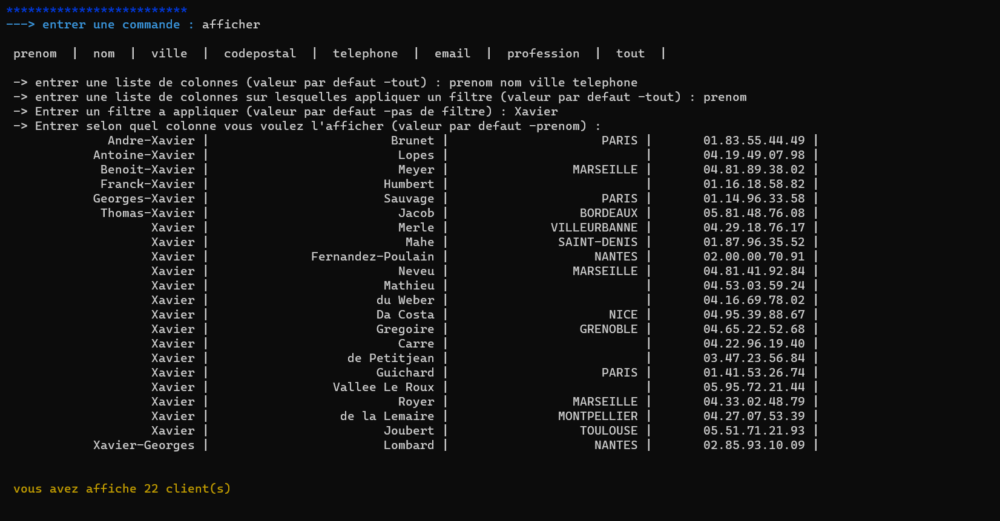

# SAE Directory administrator

## Project presentation

This project is a C language application developped during my first year of BUT info at [IUT Lyon 1](https://iut.univ-lyon1.fr/). This application handle a directory of contacts and allows to add, delete,search and modify data. The repository contains a executable of the app and the source code with all the commits process. There is also a [annuaire5000.csv](./annuaire5000.csv) witch contains a set of generated data for testing the app.

## Try it now

You can clone the repository and play with the sample data provided.

The data is formatted line by line and must be imported when the application is opened. they are stored in [this document](./annuaire5000.csv).

## Visuals of the application

Here below some examples in images of use of the application

 - For the first screen, there is all the commands available in the terminal :
    
    
 - For the second example, i want to show the reserche functionality :

    

- Here is also an example of the commands for adding a neww person in the directory :

    

## Authors

**Mathis Guerin**

- [ ] [My GitHub](https://github.com/Hubrec)
- [ ] [My Linkedin](https://www.linkedin.com/in/mathis-guerin-43b228222/)

## License

This project is under a MIT licence.

## Project status

The development of the project is closed for the moment and offers a stable version
